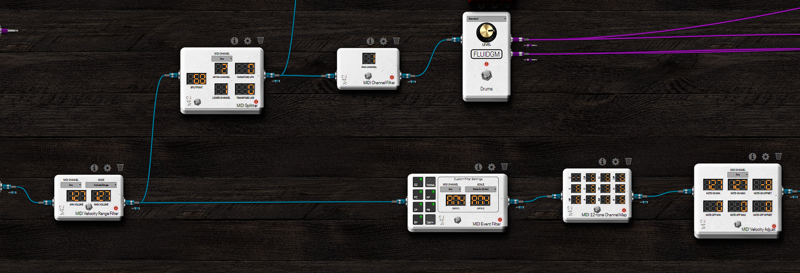

# Launchpad-MODEP Initial Setting Guide

## 1. Install Patchbox
Read [Patchbox OS Documentation](https://blokas.io/patchbox-os/docs/install-os-to-sd-card/)
and install Patchbox OS

## 2. Install MODEP
in shell command
```sh
patchbox
```
and select
```sh
module
modep
```

### First Installation LV2 Plugin Issue
No plugins are installed in first installation.  
check
[this issue](https://community.blokas.io/t/no-plugins-at-fresh-new-install/4143)
and [this method](https://community.blokas.io/t/can-i-install-modep-without-patchbox/4041/5)  
```sh
sudo apt install -y modep-lv2-*
sudo cp -r /usr/modep/lv2/* /var/modep/lv2/
sudo chown -R modep:modep /var/modep/lv2
sudo chmod -R 775 /var/modep/lv2

# Restart MODEP so LV2 changes take effect.
sudo systemctl stop modep-mod-host modep-mod-ui
sudo systemctl start modep-mod-host modep-mod-ui
```

## 3. SendMIDI
[SendMIDI](https://github.com/gbevin/SendMIDI) is a multi-platform command-line tool makes it very easy to quickly send MIDI messages to MIDI devices from your computer.  
MODEP dosen't have method to send sysex.  
A launchpad needs sysex to change layout.
```
Change the button layout
F0h 00h 20h 29h 02h 18h 22h <Layout> F7h
```
SendMidi can be method to change layout at booting.

### Install SendMIDI
#### build
```
git clone https://github.com/gbevin/SendMIDI
cd SendMIDI/Builds/LinuxMakefile
make
```

#### copy excutable  
in SendMIDI/Builds
```
cp build/sendmidi ~/
```

#### copy layout setting shell files 
```
cd <this_guide_folder>/session_launch.sh
cd <this_guide_folder>/user1_launch.sh
```

#### register layout setting on boot
```
crontab -e
```
```
@reboot sh /home/patch/user1_launch.sh
or
@reboot sh /home/patch/session_launch.sh
```

## 4. Pedalboard
Now just make pedalboard in MODEP!

Below image is sample for lighting on note on

